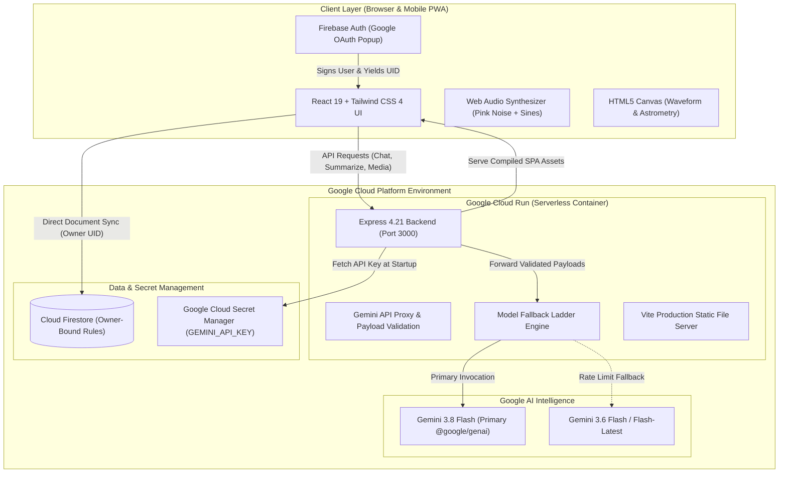
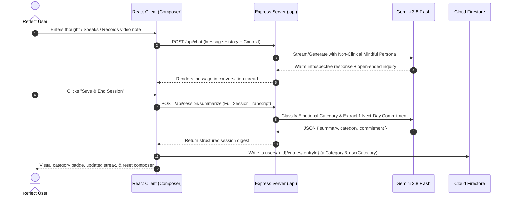
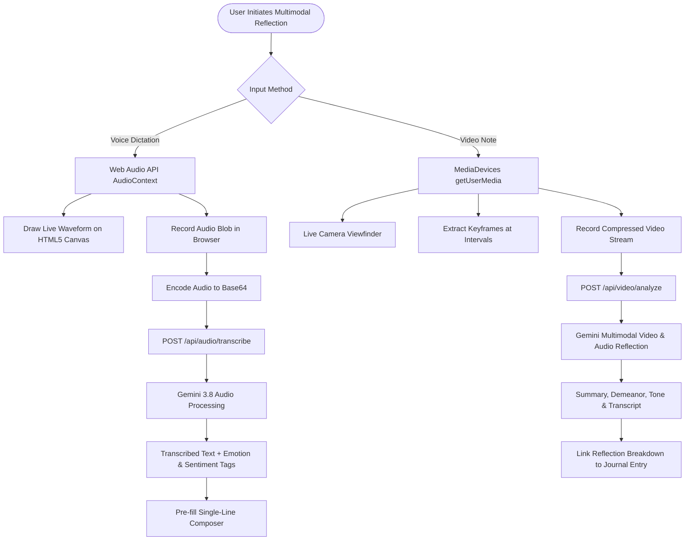
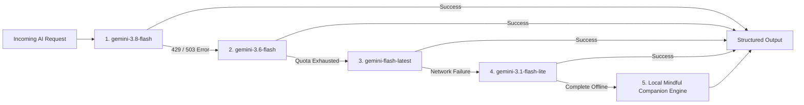

# Reflect — Mindful Personal Journaling Application

<div align="center">


<br/>

[](https://cloud.google.com/run)
[](https://ais-pre-orggpgj6yj7hzn4xegujpw-132742789172.asia-southeast1.run.app)

<br/>

[](https://react.dev/)
[](https://www.typescriptlang.org/)
[](https://vitejs.dev/)
[](https://tailwindcss.com/)
[](https://expressjs.com/)
[](https://ai.google.dev/)
[](https://firebase.google.com/)
[](https://cloud.google.com/run)
[](LICENSE)

<p align="center">
  <strong>A calm, private, and restorative journaling companion powered by Gemini AI, Cloud Firestore, and Google Cloud Run.</strong><br/>
  Conversational reflection · Smart emotional categorization · Voice dictation & video notes · Weekly retrospective digests · Astronomical stillness space · Time-capsule letters · Ambient Web Audio sound bed
</p>

[🌐 **Live Preview (Shared)**](https://ais-pre-orggpgj6yj7hzn4xegujpw-132742789172.asia-southeast1.run.app) &nbsp;•&nbsp; [🛠️ **Development Instance**](https://ais-dev-orggpgj6yj7hzn4xegujpw-132742789172.asia-southeast1.run.app) &nbsp;•&nbsp; [📖 **Architecture**](#-system-architecture) &nbsp;•&nbsp; [🧪 **Testing Matrix**](#-verification--testing-guide) &nbsp;•&nbsp; [☁️ **Deployment**](#-production-deployment)

</div>

---

## 🌿 Table of Contents

- [Overview](#-overview)
- [Interactive System Flowcharts](#-interactive-system-flowcharts)
  - [1. Full Cloud & Application Topology](#1-full-cloud--application-topology)
  - [2. Conversational Reflection & AI Synthesis Flow](#2-conversational-reflection--ai-synthesis-flow)
  - [3. Multimodal Audio & Video Note Pipeline](#3-multimodal-audio--video-note-pipeline)
  - [4. Resilient Model Fallback Ladder](#4-resilient-model-fallback-ladder)
- [Key Features](#-key-features)
  - [1. Conversational Reflection & Memory (My Space)](#1-conversational-reflection--memory-my-space)
  - [2. Multimodal Journaling: Voice & Video Notes](#2-multimodal-journaling-voice--video-notes)
  - [3. Longitudinal Patterns & Cadence Heatmap](#3-longitudinal-patterns--cadence-heatmap)
  - [4. Stillness Calm Space: Astronomy & Untangle](#4-stillness-calm-space-astronomy--untangle)
  - [5. Dear Future Me (Time-Capsule Letters)](#5-dear-future-me-time-capsule-letters)
  - [6. Sensory Experience & Web Audio Sound Bed](#6-sensory-experience--web-audio-sound-bed)
  - [7. Mobile-First Adaptive Experience](#7-mobile-first-adaptive-experience)
- [System Architecture](#-system-architecture)
  - [High-Level Architecture](#high-level-architecture)
  - [Backend API Route Matrix](#backend-api-route-matrix)
  - [Firestore Document Schema](#firestore-document-schema)
- [Deep Dive Specifications](#-deep-dive-specifications)
  - [AI Prompt Engineering & Mindful Persona](#-ai-prompt-engineering--mindful-persona)
  - [Real-Time Web Audio Synthesizer Specs](#-real-time-web-audio-synthesizer-specs)
  - [Astronomical Constellation Catalog](#-astronomical-constellation-catalog)
- [Security & Threat Architecture](#-security--threat-architecture)
  - [Zero-Secret Client Hygiene](#zero-secret-client-hygiene)
  - [Firestore Security Rules](#firestore-security-rules)
  - [Owner-Bound Isolation Proof](#owner-bound-isolation-proof)
- [Google Cloud Run AI Challenge Compliance](#-google-cloud-run-ai-challenge-compliance)
- [Getting Started](#-getting-started)
  - [Prerequisites](#prerequisites)
  - [Local Development Setup](#local-development-setup)
- [Production Deployment](#-production-deployment)
  - [Secret Manager Configuration](#secret-manager-configuration)
  - [Google Cloud Run Deployment](#google-cloud-run-deployment)
- [Verification & Testing Guide](#-verification--testing-guide)
- [Tech Stack](#-tech-stack)

---

## 📖 Overview

**Reflect** is designed from the ground up as a private sanctuary for daily thought, not a transactional chatbot or rigid form. It provides an unhurried, empathetic space where users can untangle complex feelings, cultivate self-awareness, and capture personal growth over time.

- **Empathetic Sounding Board**: Gemini responds with mindful inquiry, reflective reframing, and gentle questions rather than clinical advice, diagnostic labels, or unsolicited task lists.
- **Durable Cloud Persistence**: Every thought, session, weekly retrospective, and future letter is secured in Google Cloud Firestore under owner-isolated security rules.
- **Privacy First**: Zero third-party telemetry, zero client-exposed API keys, and fully opt-in multimedia/geolocation features.
- **Adaptive Multimodal Input**: Seamlessly switch between reflective writing, real-time voice dictation with an animated waveform, and short video reflection notes.

---

## 📊 Interactive System Flowcharts

### 1. Full Cloud & Application Topology

The following diagram illustrates the complete end-to-end cloud and client topology, demonstrating strict separation of concerns, zero-secret client exposure, and secure GCP service integration:



---

### 2. Conversational Reflection & AI Synthesis Flow

How a user's raw thoughts transform into structured memory, emotional insights, and next-day intentions:



---

### 3. Multimodal Audio & Video Note Pipeline

Handling voice dictation and video note reflections without exposing secrets or saving massive binaries to the database:



---

### 4. Resilient Model Fallback Ladder

Guarantees high availability and smooth continuity even during API rate limits or regional quotas:



---

## ✨ Key Features

### 1. Conversational Reflection & Memory (My Space)
* **Multi-Turn Contextual Dialog**: Chat naturally with Gemini as your reflective sounding board. The model holds conversational continuity within a session, acknowledging nuances and asking meaningful open-ended questions.
* **Smart Emotional Categorization**: When saving a reflection, Gemini categorizes the entry into one of seven emotional themes:
  * 🌿 **Gratitude** (`#059669` Emerald) — Appreciation, contentment, thankfulness
  * 🍊 **Stress** (`#D97706` Amber/Orange) — Pressure, overwhelm, tension
  * 🌊 **Reflection** (`#2563EB` Royal Blue) — Introspection, understanding, self-discovery
  * ☀️ **Excitement** (`#CA8A04` Warm Gold) — Joy, anticipation, high energy
  * 🧭 **Problem-Solving** (`#0D9488` Teal) — Clarity, decisions, analytical thinking
  * 🌸 **Sadness** (`#E11D48` Rose) — Grief, vulnerability, melancholy
  * 🕊️ **Neutral** (`#71717A` Stone Zinc) — General observations, daily logs, balanced thoughts
* **Dual-Track Category Retention**: Both `aiCategory` (Gemini's initial classification) and `userCategory` (the user's manual correction) are saved, allowing users to override labels without erasing the original AI insight.
* **Next-Day Micro-Commitment Loop**: Gemini extracts one realistic, bite-sized intention for tomorrow. On the subsequent calendar day, a gentle check-in banner appears (*"Did you get a chance to take a 10-minute walk?"*) with one-tap confirmation that marks it complete.
* **Ice-Breaker Starters**: A randomized pool of 40+ introspective prompts with shuffle mechanics that prevent repeats within a session, augmented asynchronously with contextual prompts generated by Gemini.
* **Session Resilience**: Active drafts survive tab navigation and browser refreshes (`sessionStorage`). In-flight Gemini generation continues running smoothly in the background when switching views.
* **Expandable History Drawer**: Browse past reflections grouped into *Today*, *Yesterday*, *This Week*, and *Earlier*, with chronological sorting, full-text reading, and inline non-blocking deletion.
* **Print-Ready PDF Archiving**: Export single or bulk reflections as cleanly formatted typography documents suitable for physical printing or offline archiving.

---

### 2. Multimodal Journaling: Voice & Video Notes
* **Adaptive Composer & '+' Menu**: The text composer maintains an elegant single-line profile with auto-expansion as you write. Secondary tools are neatly organized under the `+` menu with full-row interactive touch targets on mobile and desktop.
* **Voice Dictation & Transcription**: Capture stream-of-consciousness thoughts through the microphone. Features a live canvas audio waveform visualizer and server-side transcription using Gemini, returning transcribed text, emotional tone summaries, and sentiment tags.
* **Video Notes**: Record short video journal entries with front/back camera toggling. Gemini processes your spoken thoughts and reflection tone to generate emotional insights and summaries directly alongside your entries.
* **Opt-In Geocoding**: Tag reflections with human-readable location names (e.g., *"Kyoto, Japan"*) via OpenStreetMap Nominatim reverse geocoding, requiring explicit user permission.

---

### 3. Longitudinal Patterns & Cadence Heatmap
* **Interactive Frequency Heatmap**: Visualizes annual and monthly journaling cadence, color-coded by the dominant emotional category of each day.
* **Diurnal Rhythm Breakdown**: Dissects reflection habits across four diurnal periods:
  * 🌅 **Morning** (6:00 AM – 12:00 PM)
  * ☀️ **Afternoon** (12:00 PM – 6:00 PM)
  * 🌆 **Evening** (6:00 PM – 11:00 PM)
  * 🌙 **Night** (11:00 PM – 6:00 AM)
* **Weekly AI Retrospective Digests**: Once a week (or upon request when entries accumulate), Gemini synthesizes reflections into a structured digest featuring:
  * Poetic title capturing the week's essence
  * Dominant theme chips
  * Emotional journey narrative
  * Category distribution percentage breakdown
  * Gentle, non-judgmental observations
  * Closing affirmation and encouragement

---

### 4. Stillness Calm Space: Astronomy & Untangle
* **Authentic Constellation Tracing**: Select from 14 real astronomical constellations (Orion, Ursa Major, Cassiopeia, Cygnus, Scorpius, etc.). Tap or drag between genuine star coordinates in a peaceful night sky. Correct connections lock with a radiant glow; incorrect attempts dissolve gently without buzzers, timers, or error penalties.
* **Astronomical Lore & Myth**: Upon completing a constellation, Gemini provides a warm, authentic cultural and astronomical narrative describing the constellation's history, notable stars, and sky visibility.
* **Free Sky Mode**: An unguided star canvas allowing users to place stars, draw celestial connections, and create custom constellations without rules or scores.
* **Planar Graph Untangling**: A tranquil physics-based node puzzle where intersecting lines softly glow amber and resolve to emerald as lines are disentangled.
* **Gentle Stress Referral**: When an entry is classified as *Stress* or *Sadness*, a gentle dismissible banner offers an invitation to decompress in the Stillness space.

---

### 5. Dear Future Me (Time-Capsule Letters)
* **Sealed Future Delivery**: Write letters to your future self and schedule them for 1 month, 3 months, 6 months, 1 year, or a custom target date.
* **Lock State**: Letters remain sealed in Cloud Firestore until the designated date arrives, displaying a gentle countdown.
* **Unlock Ceremony & Reflection Prompt**: Once unlocked, letters reveal the original composition alongside a Gemini-generated introspection question comparing who wrote the letter to who is reading it.

---

### 6. Sensory Experience & Web Audio Sound Bed
* **In-Browser Web Audio Synthesizer**: Generates a soft, non-melodic filtered pink/brown noise bed layered with dual grounding sine hums at harmonic frequencies (108 Hz & 162 Hz).
* **Context-Aware Acoustic Filtering**: Automatically shifts its filter cutoff frequency higher (~380 Hz) in the Stillness space for an ethereal atmosphere, settling into a warmer tone (~250 Hz) during journaling.
* **Smooth Fades & Zero Assets**: Completely synthesized in real time via the Web Audio API without downloading bulky MP3 files. Includes an unobtrusive volume slider and persistent toggle state.
* **Mindful Avatar System**: Choose from 6 custom zen avatars (*Zen Lotus*, *Crescent Moon*, *Inner Compass*, *Mountain Peak*, *Gentle Wave*, *Quiet Flame*) or your Google profile photo, synchronized across the header, chat messages, and settings.
* **Growing Streak Metaphor**: Celebrates habit formation with an organic growth ladder:
  * 0 Days: *Ready to Bloom* 🌱
  * 1–2 Days: *Seedling Sprout* 🌿
  * 3–6 Days: *Flourishing Growth* 🌸
  * 7–13 Days: *Blooming Lotus* 🪷
  * 14+ Days: *Deep-Rooted Tree* 🌳

---

### 7. Mobile-First Adaptive Experience
* **Fixed Bottom Navigation Bar**: On mobile viewports (<768px), navigation transitions to a persistent, thumb-friendly bottom bar with equal-width touch targets for *My Space*, *Patterns*, *Future Me*, and *Stillness*, complete with safe-area padding.
* **Adaptive Single-Line Composer**: Textarea auto-grows dynamically with input while maintaining a clean single-line profile at rest without internal scrollbars. Secondary multimodal tools collapse into a compact `+` menu on narrow screens.
* **Warm Obsidian & Cream Palette**: High-contrast, WCAG AA-compliant light mode with warm stone neutrals, paired with an eye-safe dark mode.

---

## 🏗️ System Architecture

### High-Level Architecture

```
┌─────────────────────────────────────────────────────────────────────────┐
│                      CLIENT (Browser / Mobile PWA)                       │
│  React 19 + TypeScript + Vite 6 + Tailwind CSS 4 + Motion + Lucide     │
│                                                                         │
│   ┌───────────────────────────┐      ┌───────────────────────────────┐  │
│   │   Firebase Auth (GSI)     │      │   Web Audio Synthesizer       │  │
│   │   Google Popup Sign-In    │      │   Pink/Brown Noise + Sine     │  │
│   └─────────────┬─────────────┘      └───────────────────────────────┘  │
└─────────────────┼───────────────────────────────────┬───────────────────┘
                  │ Identity JWT                      │
                  ▼                                   ▼
┌───────────────────────────────────┐    ┌────────────────────────────────┐
│      Cloud Firestore (GCP)        │    │  Express Full-Stack Server     │
│                                   │    │  Cloud Run (Port 3000)         │
│  Owner-Bound Path Isolation:      │    │                                │
│  users/{uid}/entries/{entryId}    │    │  • Multi-turn Dialog Proxy     │
│  users/{uid}/digests/{digestId}   │    │  • Audio/Video Transcribe      │
│  users/{uid}/letters/{letterId}   │    │  • Reverse Geocode Proxy       │
│  users/{uid}/settings             │    │  • Constellation Lore Engine   │
│                                   │    └───────────────┬────────────────┘
│  Enforced via firestore.rules     │                    │ Server-Side Secret
└───────────────────────────────────┘                    ▼
                                         ┌────────────────────────────────┐
                                         │       Gemini 3.8 / 3.6 API     │
                                         │       @google/genai SDK        │
                                         └────────────────────────────────┘
```

### Backend API Route Matrix

All AI and external requests route through the Express server to prevent API key exposure and apply payload validation.

| Method | Route | Description | Primary Payload |
| :--- | :--- | :--- | :--- |
| `GET` | `/api/health` | Liveness and readiness probe for container orchestrator | None |
| `POST` | `/api/chat` | Multi-turn conversational companion response | `{ messages, userContext }` |
| `POST` | `/api/session/summarize` | Summarizes reflection, assigns emotional category, extracts commitment | `{ transcript }` |
| `POST` | `/api/audio/transcribe` | Transcribes audio recording with emotion tags and sentiment analysis | `{ audioBase64, mimeType }` |
| `POST` | `/api/video/analyze` | Analyzes video note keyframes and audio for spoken thoughts and mood | `{ frames, audioData, mimeType }` |
| `POST` | `/api/letter/unlock-reflection` | Generates comparative introspective question for unlocked letter | `{ letterContent, createdDate }` |
| `POST` | `/api/constellation/lore` | Generates rich astronomical and cultural narrative for completed constellation | `{ constellationName, stars }` |
| `POST` | `/api/constellation/name` | Suggests poetic celestial name for freeform sky drawing | `{ stars, connections }` |
| `POST` | `/api/digest/generate` | Synthesizes accumulated entries into a weekly retrospective digest | `{ entries[] }` |
| `POST` | `/api/prompts/generate` | Generates personalized journaling prompts based on recent themes | `{ recentCategories[] }` |
| `GET` | `/api/geocode/reverse` | Reverse geocodes coordinates via OpenStreetMap Nominatim | `?lat={lat}&lon={lon}` |

### Firestore Document Schema

```
databases/(default)/documents
└── users/{userId}
    ├── settings/preferences
    │     ├── theme: "light" | "dark" | "system"
    │     ├── customAvatar: "default" | "lotus" | "moon" | "compass" | ...
    │     ├── locationEnabled: boolean
    │     ├── ambientSoundEnabled: boolean
    │     └── dailyCheckinsEnabled: boolean
    │
    ├── entries/{entryId}
    │     ├── createdAt: Timestamp
    │     ├── createdAtMillis: number
    │     ├── summary: string
    │     ├── aiCategory: EmotionalCategory
    │     ├── userCategory: EmotionalCategory | null
    │     ├── messages: Array<{ role: 'user' | 'assistant', text: string, timestamp: number }>
    │     ├── locationTag: string | null
    │     ├── nextDayCommitment: string | null
    │     ├── commitmentCheckin: { status: 'completed' | 'not_yet' | 'skipped', date: string } | null
    │     └── multimedia: { type: 'audio' | 'video', summary: string } | null
    │
    ├── digests/{digestId}
    │     ├── createdAt: Timestamp
    │     ├── createdAtMillis: number
    │     ├── title: string
    │     ├── dateRange: { startDate: string, endDate: string, startMillis: number, endMillis: number }
    │     ├── entryCount: number
    │     ├── themes: string[]
    │     ├── moodShift: string
    │     ├── distribution: Record<EmotionalCategory, number>
    │     ├── observations: string[]
    │     └── closingAffirmation: string
    │
    └── letters/{letterId}
          ├── createdAt: Timestamp
          ├── createdAtMillis: number
          ├── scheduledDate: string
          ├── scheduledMillis: number
          ├── content: string
          ├── unlocked: boolean
          └── reflectionQuestion: string | null
```

---

## 🔍 Deep Dive Specifications

<details>
<summary>🧠 <strong>AI Prompt Engineering & Mindful Persona</strong> (Click to Expand)</summary>

### The Mindful Companion Instruction Architecture
Reflect's conversational persona rejects the robotic, transactional habits of generic AI chatbots. The system instruction adheres to five cardinal rules:

1. **Non-Clinical Demeanor**: Never use psychiatric diagnostic labels (*"You sound depressed/manic/clinically anxious"*). Instead, validate feelings with gentle curiosity (*"It sounds like you carried a heavy weight today"*).
2. **Inquiry Over Prescription**: Refrain from offering 10-step productivity lists. Instead, ask one insightful, open-ended question that helps the user unpack their own thoughts.
3. **Pacing & Warmth**: Maintain unhurried language, natural paragraph spacing, and calm sentence rhythms.
4. **Structured JSON Extraction**: During session finalization, Gemini acts as an analytical extractor, producing strict JSON without markdown fences:
   ```json
   {
     "summary": "Concise 2-sentence summary of the core insight or narrative.",
     "category": "Gratitude" | "Stress" | "Reflection" | "Excitement" | "Problem-Solving" | "Sadness" | "Neutral",
     "commitment": "Single bite-sized action for tomorrow (or null if purely reflective)"
   }
   ```
</details>

<details>
<summary>🎵 <strong>Real-Time Web Audio Synthesizer Specs</strong> (Click to Expand)</summary>

### Zero-Asset Harmonic Sound Bed
Reflect avoids heavy MP3 downloads by synthesizing a calm, restorative acoustic atmosphere entirely in the user's browser using the Web Audio API:

* **Noise Generation**: A 5-second loopable AudioBuffer populated with white noise, passed through a low-order Paul Kellet filter approximation to produce velvety pink/brown noise.
* **Low-Pass Biquad Filter**:
  * Default journaling frequency: `250 Hz` (warm, grounding)
  * Stillness sky space frequency: `380 Hz` (open, celestial)
  * Resonant Q factor: `0.7` (Butterworth maximally flat passband)
* **Harmonic Grounding Tones**:
  * Fundamental Root: `108 Hz` Sine Oscillator (gain: `0.025`)
  * Perfect Fifth Harmonic: `162 Hz` Sine Oscillator (gain: `0.015`)
* **Click-Free Transitions**: All gain parameter modulations use `linearRampToValueAtTime` over `0.8s` to ensure zero audible clicks or pops when toggling or adjusting volume.
</details>

<details>
<summary>🌌 <strong>Astronomical Constellation Catalog</strong> (Click to Expand)</summary>

### 14 Authentic IAU Constellations Supported
Each constellation features precise normalized star coordinates and connection indices:

| Constellation | Latin / Common Name | Main Stars | Lore Theme |
| :--- | :--- | :-: | :--- |
| **Ursa Major** | The Great Bear / Big Dipper | 7 | Navigation, pointer stars to Polaris, ancient myths |
| **Orion** | The Hunter | 8 | Betelgeuse, Rigel, winter celestial anchor |
| **Cassiopeia** | The Queen's Throne | 5 | Northern circumpolar "W", mythical vanity |
| **Cygnus** | The Celestial Swan | 6 | Deneb, Northern Cross, Milky Way rift |
| **Scorpius** | The Scorpion | 7 | Antares (Heart of the Scorpion), summer sentinel |
| **Leo** | The Lion | 7 | Regulus, Spring herald, ancient royal star |
| **Taurus** | The Bull | 6 | Aldebaran, Pleiades neighbor, winter horn |
| **Pegasus** | The Winged Horse | 6 | Great Square of Pegasus, autumn sky |
| **Aquila** | The Eagle | 5 | Altair, Summer Triangle member, messenger |
| **Crux** | The Southern Cross | 4 | Southern navigational beacon |
| **Lyra** | The Harp | 5 | Vega, celestial music, Orpheus myth |
| **Canis Major** | The Greater Dog | 6 | Sirius (the Dog Star), brightest star in the sky |
| **Gemini** | The Heavenly Twins | 6 | Castor and Pollux, brotherhood in the stars |
| **Bootes** | The Herdsman | 6 | Arcturus, celestial shepherd, orange giant |
</details>

---

## 🛡️ Security & Threat Architecture

### Zero-Secret Client Hygiene
- **Strict Server Proxying**: `GEMINI_API_KEY` is loaded strictly on the Node.js server via `process.env.GEMINI_API_KEY` or Google Cloud Secret Manager. No client build bundle (`dist/`) contains any secret keys.
- **Defensive Request Boundaries**: Express enforces strict 50MB payload limits for multimodal requests and structured JSON schema validation.
- **Client Sanitization**: All user inputs are rendered through React JSX escaping to eliminate XSS risks.

### Firestore Security Rules
All read and write access is locked to the authenticated owner. Subcollections inherit this isolation via recursive matching:

```javascript
rules_version = '2';
service cloud.firestore {
  match /databases/{database}/documents {
    // User data isolation: only authenticated owner can read or write
    match /users/{userId} {
      allow read, write: if request.auth != null && request.auth.uid == userId;

      match /{allSubcollections=**} {
        allow read, write: if request.auth != null && request.auth.uid == userId;
      }
    }
  }
}
```

### Owner-Bound Isolation Proof
* **User A (`uid: abc`)**: Accesses `/users/abc/entries/*` ✅ Allowed.
* **User B (`uid: xyz`)**: Attempts access to `/users/abc/entries/*` ❌ Denied by Firestore engine at rule layer.
* **Unauthenticated Request**: Attempts access to any document ❌ Denied (`request.auth == null`).

---

## 🏆 Google Cloud Run AI Challenge Compliance

This project is built and optimized for the **Google Cloud Run AI Challenge**:

1. **Mandatory Campaign Verification Label**:
   The deployed Cloud Run service is labeled with `dev-tutorial=cloud-run-ai-challenge` for automated verification:
   ```bash
   gcloud run services update reflect \
     --update-labels=dev-tutorial=cloud-run-ai-challenge
   ```
2. **Serverless Scalability**:
   Runs as a containerized full-stack application on Cloud Run, scaling to zero when idle and rapidly handling traffic spikes without state loss.
3. **Google GenAI SDK Integration**:
   Uses the modern official `@google/genai` TypeScript SDK with server-side proxying and multi-tier model fallbacks (`gemini-3.8-flash` → `gemini-3.6-flash` → `gemini-flash-latest`).
4. **Google Cloud Secret Manager**:
   Zero secrets are baked into container images or client code. The API key is securely injected via Secret Manager at runtime.
5. **Cloud Firestore Persistence**:
   Employs Google Cloud Firestore for serverless, real-time NoSQL data persistence with declarative owner-bound security rules.

---

## 🚀 Getting Started

### Prerequisites
* **Node.js**: v20.0.0 or higher
* **npm**: v10.0.0 or higher
* **Google Cloud Project**: With Billing and Firestore enabled
* **Gemini API Key**: From [Google AI Studio](https://aistudio.google.com/)

### Local Development Setup

1. **Clone the Repository**
   ```bash
   git clone https://github.com/your-username/reflect.git
   cd reflect
   ```

2. **Install Dependencies**
   ```bash
   npm install
   ```

3. **Configure Environment Variables**
   Create a `.env` file in the project root:
   ```env
   # Server Secrets
   GEMINI_API_KEY=your_gemini_api_key_here
   PORT=3000
   NODE_ENV=development

   # Client Firebase Configuration (Safe for browser)
   VITE_FIREBASE_API_KEY=your_firebase_api_key
   VITE_FIREBASE_AUTH_DOMAIN=your_project.firebaseapp.com
   VITE_FIREBASE_PROJECT_ID=your_project_id
   VITE_FIREBASE_STORAGE_BUCKET=your_project.appspot.com
   VITE_FIREBASE_MESSAGING_SENDER_ID=your_sender_id
   VITE_FIREBASE_APP_ID=your_app_id
   ```

4. **Start the Development Server**
   ```bash
   npm run dev
   ```
   Open your browser to `http://localhost:3000`.

---

## 📦 Production Deployment

### Secret Manager Configuration

Store the `GEMINI_API_KEY` securely in Google Cloud Secret Manager:

```bash
# 1. Create and populate the secret
gcloud secrets create GEMINI_API_KEY --replication-policy="automatic"
echo -n "YOUR_GEMINI_API_KEY" | gcloud secrets versions add GEMINI_API_KEY --data-file=-

# 2. Grant the Cloud Run compute service account access
PROJECT_NUMBER=$(gcloud projects describe $(gcloud config get-value project) --format="value(projectNumber)")

gcloud secrets add-iam-policy-binding GEMINI_API_KEY \
  --member="serviceAccount:${PROJECT_NUMBER}-compute@developer.gserviceaccount.com" \
  --role="roles/secretmanager.secretAccessor"
```

### Google Cloud Run Deployment

Deploy the containerized full-stack application directly using Cloud Build with the mandatory challenge verification label:

```bash
gcloud run deploy reflect \
  --source . \
  --region us-central1 \
  --allow-unauthenticated \
  --set-secrets GEMINI_API_KEY=GEMINI_API_KEY:latest \
  --set-env-vars NODE_ENV=production \
  --update-labels=dev-tutorial=cloud-run-ai-challenge
```

Apply labels to an existing Cloud Run deployment:
```bash
gcloud run services update reflect \
  --update-labels=dev-tutorial=cloud-run-ai-challenge
```

Deploy Firestore Security Rules:
```bash
firebase deploy --only firestore:rules
```

---

## 🧪 Verification & Testing Guide

<details open>
<summary>📋 <strong>16-Scenario Quality Assurance Matrix</strong> (Click to Collapse)</summary>

| # | Test Scenario | Steps & Actions | Verification Criteria |
| :-: | :--- | :--- | :--- |
| **1** | **Authentication** | Click **Sign in with Google**; complete Google OAuth popup. | Profile avatar, streak counter, and view tabs render immediately. |
| **2** | **Starter Prompts** | Tap **Shuffle** on the prompt cards. | 3 new questions display without repeats; clicking a card pre-fills the composer. |
| **3** | **Conversational Dialog** | Send a reflection thought. | Empathetic thinking indicator appears; Gemini replies with mindful inquiry. |
| **4** | **Voice Dictation** | Click the microphone icon in composer; speak a thought. | Real-time audio waveform animates; transcribed text appears in input field. |
| **5** | **Video Note Capture** | Tap `+` menu → **Video note**; record a short thought. | Camera viewfinder renders; Gemini analyzes spoken thoughts & tone upon saving. |
| **6** | **Save & Categorization** | Click **Save & End Session**. | Reflection summary is generated; 1 of 7 emotional categories assigned to entry. |
| **7** | **Category Override** | Open **Past Reflections** drawer; tap category chip. | Color immediately reflects user choice; both `aiCategory` & `userCategory` persist. |
| **8** | **Micro-Commitment Loop** | Include an intention for tomorrow; save entry. | Next day, a gentle check-in banner appears (*"Did you get a chance to...?"*). |
| **9** | **Draft Resilience** | Type a message; switch tabs to *Patterns* or *Stillness*; return. | Message draft and conversational thread remain completely intact. |
| **10** | **Cadence Heatmap** | Navigate to **Patterns** tab. | Reflection frequency renders across calendar days with category colors & diurnal stats. |
| **11** | **Retrospective Digest** | In **Patterns**, click **Generate Retrospective**. | Gemini synthesizes multi-entry weekly digest with title, themes, and narrative. |
| **12** | **Constellation Tracing** | Navigate to **Stillness** → **Constellation**; trace star paths. | Star threads glow upon valid connection; completion unlocks authentic astronomical lore. |
| **13** | **Untangle Mode** | In **Stillness**, select **Untangle** physics puzzle. | Crossing lines glow amber; resolve to calming emerald when disentangled. |
| **14** | **Dear Future Me** | Navigate to **Future Me**; compose a letter; select unlock date. | Letter is stored sealed with live countdown; unlock triggers introspective inquiry. |
| **15** | **Web Audio Sound Bed** | Click the speaker icon in top bar; adjust volume slider. | Pink noise and 108Hz/162Hz sines fade in smoothly without audible clicks. |
| **16** | **Owner Isolation** | Sign in with an alternate Google account. | Previous user's entries, digests, letters, and settings remain inaccessible. |

</details>

---

## 🧰 Tech Stack

| Domain | Technology | Version | Purpose |
| :--- | :--- | :--- | :--- |
| **Frontend Framework** | React | 19.0.1 | Reactive component architecture & state hooks |
| **Language** | TypeScript | 5.8.2 | Strict type safety across client and server |
| **Build & Dev Tool** | Vite | 6.2.3 | Instant HMR and optimized production bundling |
| **Styling & Design** | Tailwind CSS | 4.1.14 | Modern utility-first CSS design system |
| **Animations** | Motion | 12.23.24 | Smooth micro-interactions and transitions |
| **Icons** | Lucide React | 0.546.0 | Minimalist iconography |
| **Backend Server** | Express | 4.21.2 | Full-stack API proxy and static asset serving |
| **Server Runtime** | Node.js / tsx | 22.x / 4.21.0 | Fast server execution and bundling |
| **AI SDK** | `@google/genai` | 2.4.0 | Official Google GenAI TypeScript SDK |
| **Authentication** | Firebase Auth | 12.18.0 | Secure client-side Google OAuth popup login |
| **Database** | Cloud Firestore | 12.18.0 | Real-time NoSQL cloud document storage |
| **Cloud Hosting** | Google Cloud Run | Managed | Fully managed serverless container runtime |
| **Secret Storage** | Secret Manager | Managed | Secure server-side credential management |

---

<div align="center">
  <sub>Reflect · Built with care for mindful, private, and intentional self-reflection.</sub>
</div>
